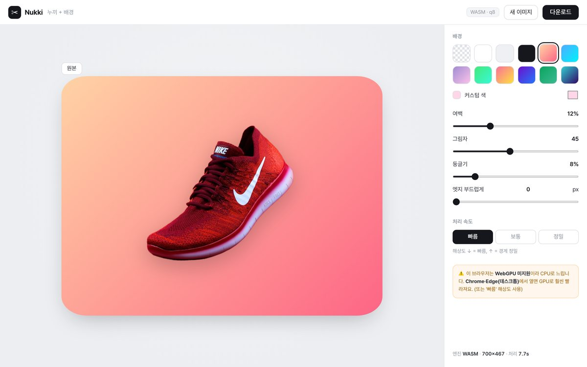

<div align="center">

# Nukki — 누끼 + 배경 (브라우저 100%)

**이미지 배경을 브라우저 안에서 바로 제거하고, 예쁜 배경에 합성하세요.**


<a href="https://inno-hi-inc.github.io/nukki/"></a>

<sub>실제 데모 화면: 샘플 이미지(samples/product.jpg) 누끼 → 그라데이션 배경 합성</sub>

**[바로 써보기](https://inno-hi-inc.github.io/nukki/)**

</div>

---

이미지 배경을 **브라우저 안에서** 바로 제거하고, shots.so 스타일로 **예쁜 배경에 합성**하는 정적 웹앱.

- **서버 전송 없음** — 누끼 AI(BRIA RMBG-1.4)가 `transformers.js`로 브라우저에서 직접 실행
- **WebGPU** 우선, 미지원 시 WASM(CPU) 폴백
- 그라데이션/단색/투명 배경 + 여백·그림자·둥글기 → PNG 다운로드
- 첫 실행 시 모델(~44MB) 1회 다운로드 후 캐시

## 로컬 실행
정적 파일이라 아무 정적 서버로 열면 됩니다:
```bash
python3 -m http.server 8011   # → http://127.0.0.1:8011
```

## 배포
GitHub Pages(정적)로 그대로 서빙됩니다. `main` 브랜치 루트.

## 구조
```
index.html   UI (shots.so 스타일)
style.css    플랫·뉴트럴 테마
app.js       transformers.js 추론 + 배경 합성 + 다운로드
samples/     예시 이미지
```

**참고:** 풀 파이프라인(BiRefNet + ViTMatte 매팅 + 색 정화)을 원하면 로컬 Python 서버판(`~/nukki`)을 쓰세요.
이 정적판은 단일 모델 컷아웃이라 머리카락 디테일이 더 소프트합니다.

---

<div align="center">
<sub>Made by <a href="https://github.com/khwee2000">김민수 (@khwee2000)</a> · <a href="https://github.com/INNO-HI-Inc">INNO-HI</a></sub>
</div>
